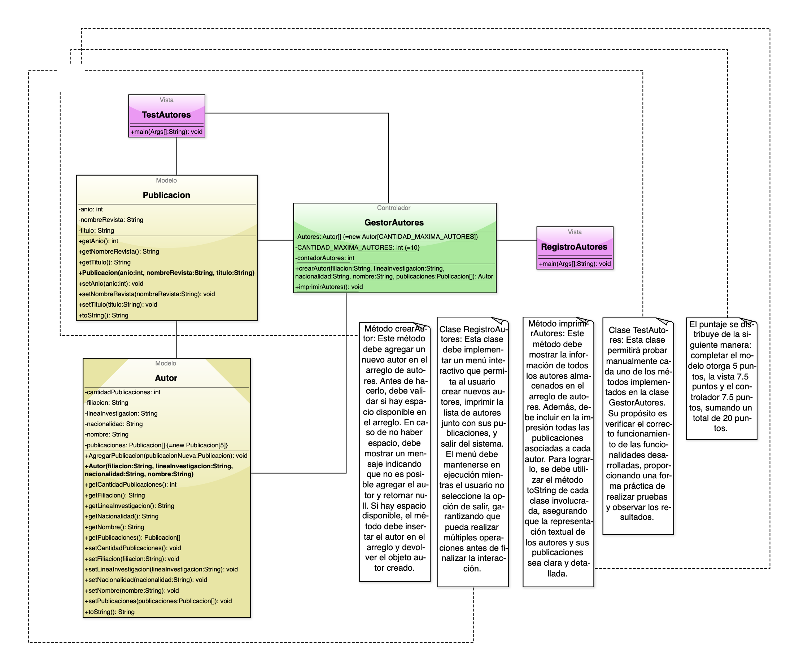

# Practica Calificada 3

Examen de Programación Orientada a Objetos (POO)

Instrucciones Generales

	1.	Realiza la solución en Java respetando la estructura y el modelo proporcionado.
	2.	Se les proporcionará un repositorio de GitHub que deberán clonar y trabajar desde allí.
	3.	Las entregas deben incluir capturas de pantalla y el código en el repositorio:
	•	Capturas de pantalla detalladas de cada componente solicitado.
	•	Subir el código con commits correspondientes por cada paquete (modelo, vista, controlador).
	•	Cada commit debe incluir tu nombre completo en el mensaje (no será suficiente con tu nombre de usuario).
	4.	La falta de alguno de estos elementos implicará una reducción en el puntaje.

Preguntas y Entregas

	1.	Implementación del Modelo:
	•	Diseña las clases Publicacion y Autor en el paquete modelo siguiendo el diagrama UML proporcionado.
	•	Asegúrate de implementar correctamente los métodos toString y otros según las especificaciones del modelo.
	•	Entrega: Captura(s) de pantalla mostrando el código completo de ambas clases.
	2.	Implementación del Controlador:
	•	Diseña la clase GestorAutores en el paquete controlador, implementando los métodos:
	•	crearAutor: Asegúrate de validar si hay espacio disponible antes de agregar un nuevo autor.
	•	imprimirAutores: Muestra todos los autores y sus publicaciones.
	•	Entrega: Captura(s) de pantalla mostrando el código completo de esta clase.
	3.	Implementación de la Vista:
	•	Diseña las clases RegistroAutores y TestAutores en el paquete vista.
	•	RegistroAutores: Implementa un menú interactivo para gestionar autores y sus publicaciones.
	•	TestAutores: Proporciona pruebas manuales para cada método implementado.
	•	Entrega: Captura(s) de pantalla mostrando el código completo de ambas clases.
	4.	Ejecución del Programa:
	•	Ejecuta tu programa y muestra el funcionamiento completo de todas las funcionalidades solicitadas:
	•	Creación de autores.
	•	Impresión de autores y sus publicaciones.
	•	Entrega: Captura(s) de pantalla mostrando los resultados de la ejecución.

Subida a GitHub

	•	Clona el repositorio asignado.
	•	Realiza commits por cada paquete:
	•	Por ejemplo, un commit para modelo, otro para controlador y otro para vista.
	•	Comentarios de los commits:
	•	Cada mensaje debe incluir tu nombre completo y describir claramente lo que realizaste.
	•	Ejemplo: “Carlos Palomino: Implementación de la clase Publicacion en el paquete modelo”.

Puntaje

	•	Modelo (5 puntos)
	•	Controlador (7.5 puntos)
	•	Vista (7.5 puntos)
	•	Entrega completa con capturas de pantalla claras, código bien comentado, y commits correctos en GitHub (5 puntos adicionales).

¡Buena suerte!
